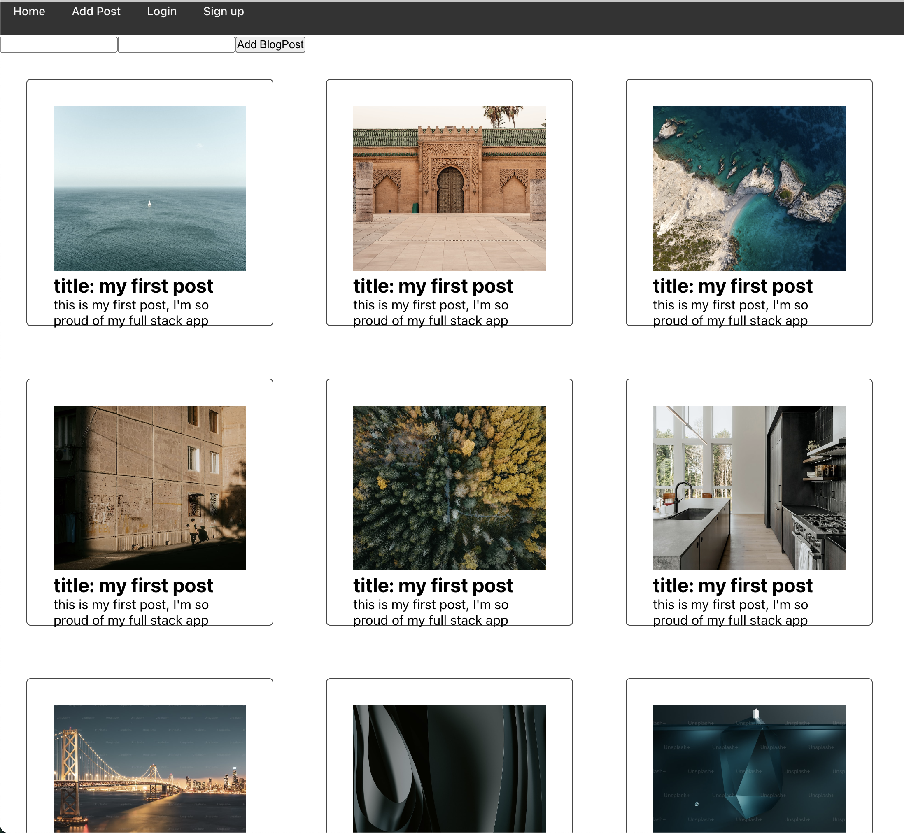

# My Blog App

This is the front end for a full stack blog app with login.

## Build Instructions
1. git clone https://github.com/bocacode/c12-blogapp-fullstack-frontend
2. cd c12-blogapp-fullstack-frontend
3. npm i
4. npm start

## Backend Repo
[Click here to view the backend](https://github.com/bocacode/c12-blogapp-fullstack-backend)